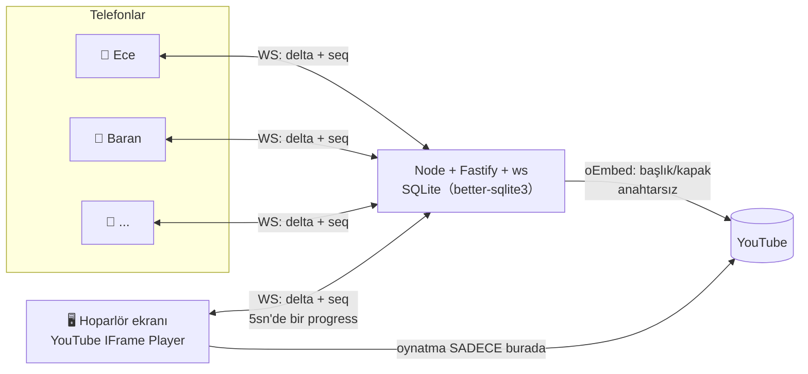

# Kavga Listesi 🥊

**Parti kuyruğu bir savaş alanıdır.** Herkes telefonundan şarkı ekler, oylar, vetolar;
sıradaki şarkı için dövüşür. Müzik tek bir ekranda çalar (laptop/TV = hoparlör),
telefonlar kumandadır. Hesap yok, uygulama yok, API anahtarı gerekmez.

```bash
pnpm install && pnpm dev        # server :3001 + client :5173
# ya da tek konteyner:
docker compose up --build       # http://localhost:3001
```

## Nasıl oynanır

| Silah | Etki | Adet |
|---|---|---|
| ▲ / ▼ oy | Kuyruk sırası = net puan (eşitlikte eski olan önde) | kişi başı şarkı başına 1 (değiştirilebilir) |
| ⚡ **Süper oy** | +3 sayılır, herkesin ekranında altın flaş | oturum başına **1**, geri alınamaz |
| 💀 **Veto** | Şarkıyı anında öldürür… ama kurban **rövanş jetonu** kazanır | oturum başına **1** |
| 🛡️ **Rövanş** | Jetonla eklediğin şarkı **zırhlı** olur — vetolanamaz (deneyen vetosunu da kaybetmez) | veto yedikçe |
| ⏭ **Skip oyu** | Çalan şarkıya aktif katılımcıların **>%50**'si skip derse plak cızırtısıyla kesilir | şarkı başına 1 |

Kuyruk biterse son çalınanlardan rastgele devam eder: **“liste bitti, dövüşün!”**
Parti sonunda rapor: gecenin DJ'i, kavganın kaybedeni (en çok vetolanan), en büyük
geri dönüş — paylaşılabilir PNG kart.

## Mimari



### Realtime senkron tasarımı (işin mühendislik kalbi)

- **Sunucu tek gerçek kaynak.** Her durum değişikliği (ekleme, oy, veto, skip) odaya
  **monoton artan `seq`** ile delta olarak yayınlanır ve aynı `seq` ile SQLite'taki
  append-only `events` tablosuna yazılır (recap de aynı logdan beslenir).
- **Boşluk tespiti:** istemci `seq`'in tam olarak `son+1` gelmediğini görürse
  `{"type":"resync"}` yollar → sunucu otoriter tam snapshot döner. Test edildi.
- **Playback ticks `seq` tüketmez** — 5 sn'de bir gelen ilerleme geçicidir, bir
  sonraki tick eskisini geçersiz kılar; "kaçırılacak state" değildir.
- **Eşzamanlılık:** better-sqlite3 senkron + Node tek thread ⇒ tüm kuyruk
  mutasyonları doğal olarak serileşir. Test: 20 istemci aynı anda aynı şarkıya
  oy atar, skor **tam olarak 20**; yarışan iki süper oy **tam olarak 1** şarj yakar.
- **Hoparlör koparsa** oda otomatik `paused` olur, telefonlar “hoparlör koptu”
  görür; host dönünce **asla kendiliğinden çalmaz** — play'e host basar.
- İstemci: kalp atışı (sunucu ping/pong 15 sn), üstel backoff'lu oto-reconnect,
  telefonda iyimser oy hissi (sunucu deltası nihai karardır).

### Güvenlik

- Tüm mutasyonlar sunucuda doğrulanır: odaya üyelik, cephanelik bakiyesi, zırh,
  kişi başı kuyruk limiti (varsayılan 2), şarkı başına tek oy — istemciye asla güven yok.
- Takma ad/başlıklar XSS-güvenli temizlenir; takma adlarda küfür filtresi.
- Oda kodları 4 harf, karışmayan alfabe (0/O, 1/I/L yok); QR token'ı ayrı ve tahmin edilemez;
  host yetkisi ayrı `hostKey` ile.

## Testler (44 ✓)

```bash
pnpm --filter @kavga/server test   # vitest
node server/scripts/smoke.mjs      # canlı sunucuya karşı uçtan uca WS senaryosu
```

Kapsananlar: sıralama (zırh/süper oy/eşitlik kırıcılar), cephanelik (ikinci veto yok,
rövanş akışı), skip eşiği (katılımcı girip çıkarken hedefin kayması), oda durum makinesi
(host kopma/dönme), **20 istemcili eşzamanlı oy — kesin skor**, seq-boşluğu → resync.

## Kurulum

```bash
pnpm install
pnpm dev                                  # geliştirme
pnpm --filter @kavga/server seed          # 5 sahte savaşçılı hazır demo odası
```

`.env.example` → `.env`: **hiçbir anahtar zorunlu değil.** `YOUTUBE_API_KEY`
verirsen telefonlarda arama açılır; vermezsen link-yapıştırma modu tam çalışır.

### Ucuz VPS'e dağıtım

```bash
git clone <repo> && cd kavga-listesi
cp .env.example .env    # PUBLIC_URL=https://alan-adin.com yap
docker compose up -d --build
# reverse proxy (Caddy örneği): kavga.alan-adin.com → localhost:3001 (WS dahil)
```

SQLite dosyası `kavga-data` volume'unda; yedek = o dosyayı kopyalamak.

## Dürüst sınırlar

- **YouTube gömme kuralları gereği oynatma, görünür host ekranında kalmalıdır.**
  Bu uygulama tasarımı gereği *ortak hoparlörlü parti aracı*dır — arka planda/gizli
  oynatma aracı veya müzik korsanlığı aracı değildir. Bazı videolar sahibinin
  tercihiyle gömülemez; o şarkı çalmaz, sıradaki gelir.
- oEmbed süre bilgisi vermez → süre, şarkı çalmaya başlayınca host player'dan öğrenilir
  (kuyruktayken süre görünmeyebilir).
- Tek süreç + SQLite: bir ev partisi/ofis için fazlasıyla yeter; yatay ölçek hedef değil.
- Oda kodu bilen katılır — bu bilinçli (parti kodu bağırılır); istenmeyen konuk host'un
  "at" düğmesiyle gider.
